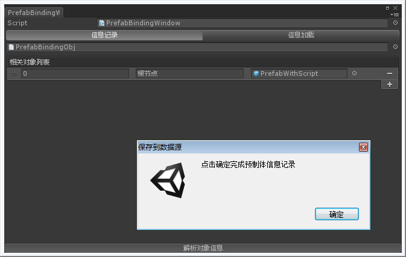
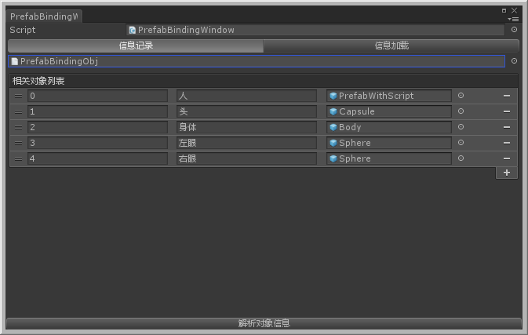
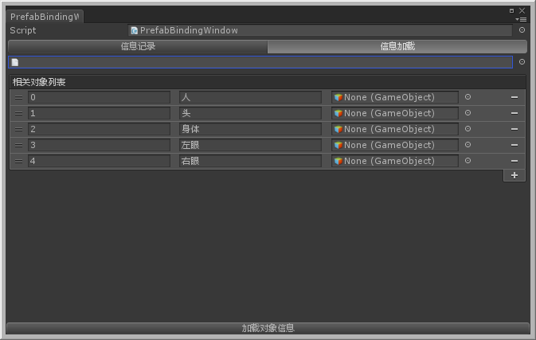
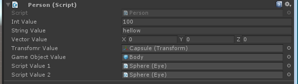

# Prefab-EditorBinding
when you need deep binding script from old prefab to new prefab.this module maybe helpful.not just support simple value such as int ,string,but alse support Object,but you must manuly drag something
## 1.Record
   
## 2.Continue Record
   
## 3.Binding
   
## 4.SupportValues
   
